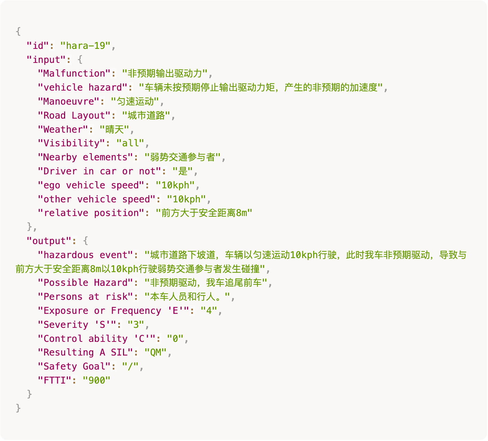

## 数据集简介 (Dataset Description)

本评测数据集源自真实工业场景的脱敏案例，总规模为 3,000 条样本。为确保评估的科学性，数据集划分为训练集、验证集和测试集三个部分，样本数量分别为 1,600 条、400 条和 1,000 条。评测过程设置~A 榜与~B 榜两个阶段：验证集数据用于 A 榜阶段的模型调试与初步排名；测试集数据则用于 B 榜阶段的最终性能评估。每条数据除包含唯一标识符 (ID) 外，具体包含以下输入与输出字段：

**输入字段：**

- **失效模式** (Malfunction)：本数据集聚焦的核心功能失效类型，即动力系统产生的 “非预期驱动力输出”；
- **整车危害** (Vehicle Hazard)：功能失效在整车层面表现出的具体危险行为，例如 “非预期加速加速度” 等；
- **车辆运行状态** (Manoeuvre)：失效发生时刻自车的动力学行为状态，涵盖匀速运动、加速运动、减速运动或静止等工况；
- **道路环境与拓扑** (Location/Road Layout)：场景所处的道路几何布局与类型，如城市道路、高速公路、停车场道路等；
- **气象条件** (Weather)：场景发生时的环境气象参数，如晴天、雨天、雪天等；
- **能见度** (Visibility)：环境光照条件及视觉清晰度，例如全可见 (All)、雾天等；
- **周边交通参与者** (Nearby Elements)：自车周围存在的潜在碰撞对象或环境要素，包括其他机动车、弱势交通参与者（如行人、骑行者）等；
- **驾驶员是否在车上** (Driver in Car or Not)：标识驾驶员是否在车内及是否处于驾驶位。该状态直接影响危害发生后的可控性评级；
- **自车速度/他车速度/他车与我车位置**：描述场景危险程度的定量参数，包括双方瞬时速度及相对空间距离。

**输出字段：**

- **危害事件描述** (Hazardous Event)：模型需结合功能失效与具体运行场景，生成一段连贯的自然语言描述，详细阐述从失效发生到潜在事故的完整演变过程。例如，“由于制动失效，车辆未能及时停车，与前车发生追尾。”
- **可能的危害** (Possible Hazard)：功能失效可能引发的直接危险后果类型，如 “车辆发生追尾”、“车辆侧滑失控” 或 “与行人碰撞” 等；
- **有风险的人员** (People at Risk)：在当前危害场景中面临潜在伤害风险的交通参与者群体，可能包括本车人员、行人或其他车辆驾驶员及乘客。
- **曝光率或频率** (Exposure or Frequency, `E`)：估该场景出现的频率或概率，通常分为不同的频率级别；
- **严重度** (Severity, `S`)：潜在伤害的严重程度分级，从轻微伤害到致命伤害等，通常与事故的后果密切相关。
- **可控性** (Controllability, `C`)：驾驶员或其他受影响人员避开或减轻危害的能力分级。通常与驾驶员反应时间、控制系统的可靠性等因素有关。
- **汽车安全完整性等级** (Resulting ASIL)：根据暴露率 (`E`)、严重度 (`S`) 和可控性 (`C`) 这三维指标综合判定的汽车安全完整性等级 (ASIL)。
- **安全目标** (Safety Goal)：为防止危害事件发生或减轻其后果所定义的顶层安全需求。例如，“确保制动系统在紧急情况下具备足够的反应能力” 或 “避免与前车发生碰撞”。
- **容错时间间隔** (FTTI)：指从故障发生到危害事件发生之间，系统必须采取安全措施的最小时间阈值，通常以毫秒为单位。FTTI 是评估系统反应速度和容错能力的重要指标。

本数据的一条样例如下图所示：

## 数据集下载 (Dataset Release)

[训练集下载](dataset/train.json)

[验证集下载](dataset/val.json)
